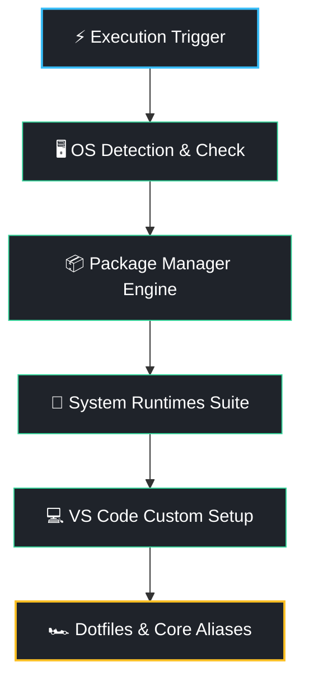

# 🚀 The Dev-OS Bootstrapper

[](https://opensource.org)
[](http://makeapullrequest.com)
[](#)

Transform a fresh, blank operating system into a **fully-loaded, high-performance development workstation in less than 5 minutes**. 

No more spending your first day at a new job manually installing runtimes, copying dotfiles, or configuring paths. Give your machine true developer superpowers with a single command.

---

## ⚡ Quick Start (Plug & Play)

Run the automated installer directly from your terminal. The script will automatically detect your OS, request required permissions, and set up your entire stack.

```bash
curl -fsSL https://githubusercontent.com | bash
```

> ⚠️ **Note:** For Linux machines, make sure you have `sudo` privileges. On macOS, the script will handle Homebrew installation automatically.

---

## 🛠️ What Gets Installed?

The Bootstrapper features a curated, enterprise-grade development stack optimized for speed and reliability:

### 📦 Package Managers
* **macOS:** Homebrew (Latest Core + Cask architecture)
* **Linux:** Advanced Package Tool (APT) repository synchronization

### 🚀 Core Runtimes & CLI Ecosystem
* **Node.js LTS** — JavaScript/TypeScript runtime environment
* **Python 3 & Pip** — Scripting, automation, and tooling core
* **Docker & Docker Compose** — Native containerization engine
* **Git** — Version control with pre-configured performance buffers
* **Essential Tooling:** `jq` (JSON processor), `fzf` (Fuzzy finder), `tldr` (Simplified man pages), `curl`, `wget`.

### 💻 IDE & Visual Studio Code Setup
Installs **VS Code** along with a production-ready extension suite:
* `dbaeumer.vscode-eslint` & `esbenp.prettier-vscode` (Code linting & automated formatting)
* `eamodio.gitlens` (Deep visual source control insights)
* `ms-azuretools.vscode-docker` (Container management within the IDE)
* `usernamehw.errorlens` (Inline error highlight)
* `pkief.material-icon-theme` (Clean typography and file tree styling)

### 🏎️ Shell Optimizations & Dotfiles
Appends high-performance configurations directly to your `~/.bashrc` or `~/.zshrc`:
* Unlimited command history preservation (`HISTSIZE=50000`)
* `code --wait` bound as the default global terminal `$EDITOR`
* **Supercharged Aliases:**
  * `g` / `gst` / `gcm` — Ultra-fast git interactions
  * `dco` / `dps` — Instantly view clean, tabular local container states
  * `myip` — Fetch external network addresses in one keyword

---

---

## 📐 Architecture Flow



---
---

## ⚙️ Customization

Want to tweak the tool stack before firing the trigger? Clone the repository locally and edit the `install_dev_tools` array inside `setup.sh`:

```bash
git clone https://github.com
cd dev-os-bootstrapper
nano setup.sh # Add/Remove your preferred packages
./setup.sh
```

---

## 🤝 Contributing

Got an optimization or a killer alias that saves hours of work? We love community upgrades! 

1. Fork the Project
2. Create your Feature Branch (`git checkout -b feature/AmazingSuperpower`)
3. Commit your Changes (`git commit -m 'Add some AmazingSuperpower'`)
4. Push to the Branch (`git push origin feature/AmazingSuperpower`)
5. Open a Pull Request

## 📝 License

Distributed under the MIT License. See `LICENSE` for more information.
